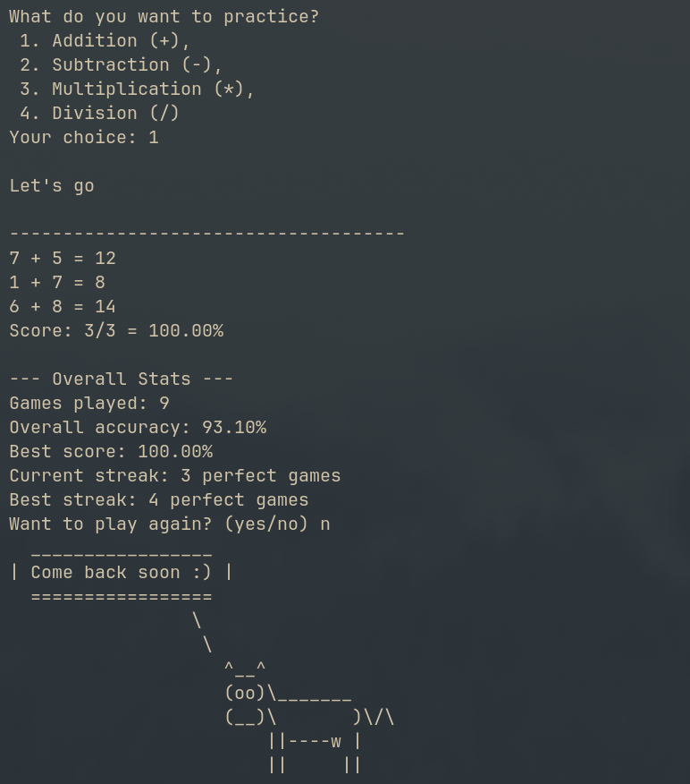

# Math Game



A robust, terminal-based math practice engine built in Python, designed with a focus on logical integrity and automated quality assurance.

## Features

- **Dynamic Modes:** Includes both standard "Solve" mode and algebraic "Find x" mode.
- **Inverse Operation Logic:** Division problems are generated via multiplication factors to guarantee clean integer results and avoid floating-point/zero-division errors.
- **Difficulty Scaling:** Three distinct levels using power-of-10 digit generation logic.
- **Robust UI:** Global `KeyboardInterrupt` handling for clean exits and custom ASCII flair using `cowsay` and `pyfiglet`.
- **Automated Audit:** Integrated GitHub Actions (CI/CD) using `flake8` to ensure PEP 8 compliance and code quality on every push.
- **Persistent Stats:** Tracks accuracy and performance across sessions.

## Tech Stack

- **Language:** Python 3.11+
- **Editor/Env:** Neovim / Linux
- **Version Control:** Git (Branch-based workflow with PRs)
- **CI/CD:** GitHub Actions
- **Dependencies:** `cowsay`, `pyfiglet`

## Installation

```bash
pip install cowsay pyfiglet
```

## Usage

```bash
python main.py
```

## Project Architecture

The project is modularized to separate core logic from game modes:

- `main_modes/`: Standard arithmetic logic (Addition, Subtraction, Multiplication, Division).
- `alt_modes/`: Algebraic "Find x" logic for enhanced mental math practice.
- `math_stats.py`: Data persistence layer for user performance tracking.
- `integers.py`: Centralized mathematical generation logic.
- `.github/workflows/`: Automated linting and quality gates.

## Roadmap

- [ ] Matplotlib performance visualization for progress tracking.

---

## License

MIT

---
